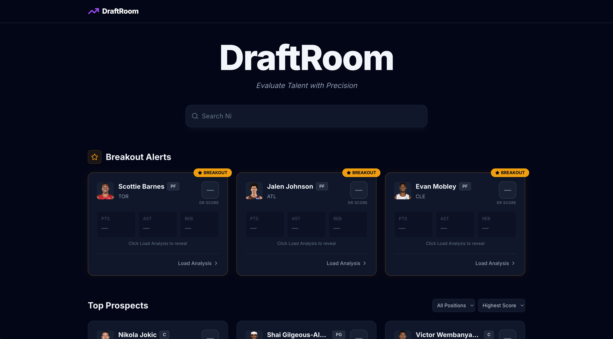
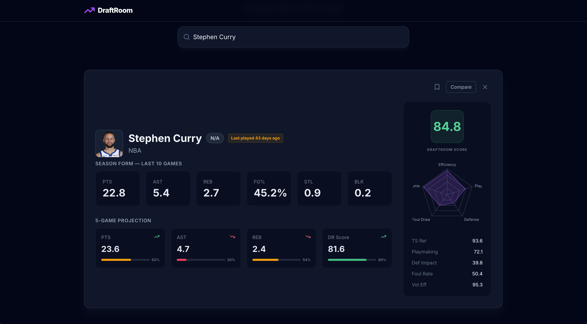

# DraftRoom 🏀
## Preview




An NBA player analytics tool that combines real stats with predictive performance indicators.

**Live Demo:** https://draftroom-frontend.vercel.app

## ⚠️ Important Note
The backend is hosted on Render's free tier and **spins down after 15 minutes of inactivity**. When you first visit the site, please allow **30-60 seconds** for the backend to wake up before searching for players. After the first request everything loads normally.

## Features
- **Live NBA Player Search** — search any active NBA player by name
- **DraftRoom Score** — proprietary efficiency rating (0-100) combining True Shooting %, playmaking, defense, foul pressure, and volume efficiency
- **Season Form** — last 10 games averaged with real stats: PTS, AST, REB, FG%, STL, BLK
- **5-Game Trajectory** — EWMA predictive model with opponent-adjusted projections and confidence scores
- **Player Comparison** — compare up to 3 players side by side with radar charts
- **Watchlist** — bookmark players and persist them across sessions

## Tech Stack
- **Frontend:** React, TypeScript, Vite, Tailwind CSS, Recharts
- **Backend:** FastAPI, Python, nba_api
- **Deployment:** Vercel (frontend) + Render (backend)

## Local Development
```bash
# Frontend
cd draftroom-frontend
npm install
npm run dev

# Backend
cd draftroom-backend
pip install fastapi uvicorn nba_api
python main.py
```

## Built By
Ashad — [GitHub](https://github.com/ashadsmh)
