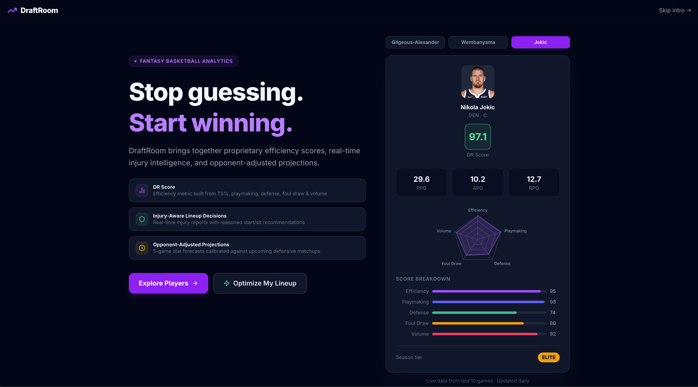

# DraftRoom 🏀

**The best analytics tool for fantasy basketball.**

Live at [draftroom-co.vercel.app](https://draftroom-co.vercel.app)

---

## What is DraftRoom?

DraftRoom gives fantasy basketball players a real edge over their league. Instead of relying on box scores and gut feel, DraftRoom surfaces a proprietary efficiency metric, injury-aware start/sit recommendations, and opponent-adjusted projections — all in one place.

Built for serious fantasy players and casual fans alike.




---

## Features

### DR Score
A proprietary efficiency rating (0–100) calculated from the last 10 games using five weighted components:
- **True Shooting %** — scoring efficiency relative to league average
- **Playmaking** — assist-to-turnover ratio
- **Defensive Impact** — steals, blocks, and defensive rebounds
- **Foul Drawing** — free throw rate as a measure of aggression
- **Volume Efficiency** — efficiency scaled by usage

Players are tiered as Elite, Star, or Prospect based on their DR Score.

### Optimize Lineup
Paste your fantasy roster and get ranked start/sit recommendations. Each recommendation is:
- Injury-aware — pulls live ESPN injury reports
- Matchup-adjusted — accounts for opponent defensive rating
- Explained — every pick comes with a clear reason (trending up, fresh legs, tough matchup, etc.)

### 5-Game Projections
An exponentially weighted moving average (EWMA) model that projects PTS, AST, REB, and DR Score over the next 5 games. Projections are adjusted for upcoming opponent defensive ratings and include a confidence score based on recent consistency.

### Player Comparison
Compare up to 3 players side by side with radar charts, season form stats, and projected trajectories.

### Build Team
Build any 5-player lineup — real rosters or dream teams — and see the combined DR Score, Offensive Rating, and Defensive Rating. Compare two squads head-to-head.

### Watchlist
Bookmark players to track throughout the season. Persists across sessions via Firebase Firestore when signed in.

---

## Tech Stack

| Layer | Technology |
|---|---|
| Frontend | React, TypeScript, Vite, Tailwind CSS, Recharts |
| Backend | FastAPI, Python, nba_api |
| Auth | Firebase Authentication (Google OAuth) |
| Database | Firebase Firestore |
| Deployment | Vercel (frontend), Render (backend) |

---

## ⚠️ Backend Cold Start

The backend runs on Render's free tier and spins down after 15 minutes of inactivity. On your first visit, allow **30–60 seconds** for it to wake up. After the first request everything loads at normal speed.

---

## Local Development

```bash
# Frontend
cd draftroom-frontend
npm install
npm run dev

# Backend
cd draftroom-backend
pip install fastapi uvicorn nba_api requests
uvicorn main:app --reload
```

---

## Built By

Ashad — [github.com/ashadsmh](https://github.com/ashadsmh)
